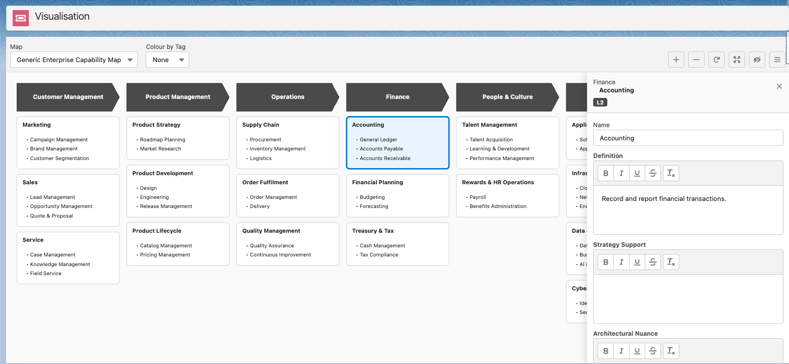

# SF Capability Mapper

> Lightweight, data-driven Business Capability Map that lives inside your Salesforce org — and stays easy to extend.


> _TODO: replace placeholder screenshots in `docs/images/` once captured._

SF Capability Mapper turns your Business Capability Model from a static Visio file or read-only LeanIX diagram into a queryable, editable, extensible Salesforce object model. Capabilities are records — not boxes on a page — so anything Salesforce can do (reports, flows, automation, permissions, custom fields) applies to your capability model out of the box.

Built for enterprise architects who want a simple tool to manage a BCM without standing up another platform.

---

## Why this, not the usual options?

|                                             | SF Capability Mapper       | LeanIX / Ardoq / Bizzdesign | Visio / Lucidchart | Spreadsheet   |
| ------------------------------------------- | -------------------------- | --------------------------- | ------------------ | ------------- |
| Lives where your business already runs      | Inside Salesforce          | Separate platform           | Separate file      | Separate file |
| Data-driven (records, not shapes)           | Yes                        | Yes                         | No                 | Partial       |
| Drag-drop hierarchy editing                 | Yes                        | Yes                         | Manual             | No            |
| Extensible with custom fields / Apex / Flow | Yes                        | Limited                     | No                 | No            |
| Per-user permissions (Viewer / Editor)      | Yes (perm sets)            | Yes                         | Filesystem         | Filesystem    |
| Cost                                        | Existing SF licence        | Per-seat SaaS               | Per-seat SaaS      | Free          |
| Vendor lock-in                              | None — your org, your data | High                        | Medium             | None          |

---

## Features

**Modelling**

- 3-level capability hierarchy (L1 / L2 / L3) per BABOK
- Cross-cutting capabilities rendered as a separate band
- Multiple Maps in one org (business units, versions, clients)
- Tags with colour swatches for categorisation

**Visualisation**

- SVG diagram with chevrons (L1), boxes (L2), bullets (L3)
- Drag-and-drop reordering and reparenting
- Zoom, pan, and pinned top row / bottom band
- Colorise-by-tag highlighting
- Slide-in Detail Panel for any node

**Data**

- Standard Salesforce sObjects — reportable, queryable, automatable
- JSON import utility for bulk loading or migration
- External ID upsert for repeatable refreshes
- Inline edit of capability fields with permission gating

**Extensibility**

- Add custom fields to `bcm_Capability__c` like any sObject
- Hook Apex triggers, Flows, Validation Rules
- Layered Apex architecture (see ADR 0002) — Selector / Service / Controller separation
- Tag taxonomy is data-driven — admins create new tags without code
- Permission Sets (`bcm_Viewer`, `bcm_Editor`) gate all writes

---

## Screenshots

**Detail Panel — inline edit a capability**



**Tag colorise — slice the model by any tag**

#TODO


---

## Data Model

Four sObjects underpin the app — see [`CONTEXT.md`](CONTEXT.md) for the full glossary.

- **`bcm_Map__c`** — named container for one capability model
- **`bcm_Capability__c`** — a single capability node (Level, Sort Order, parent, fields)
- **`bcm_Tag__c`** — colour-coded label, org-wide
- **`bcm_CapabilityTag__c`** — junction between Capabilities and Tags

---

## Extensibility

- Custom fields on `bcm_Capability__c` flow through to reports, flows, and permission sets
- Apex triggers and Flows fire on capability changes — automate downstream systems
- Validation Rules enforce model integrity (e.g. cross-cutting only at L1)
- New Tags created by admins via standard record UI — no deploy
- Layered Apex architecture (Selector / Service / Controller) keeps custom logic isolated
- LWC components (`bcm_CapabilityMap`, `bcm_CapabilityDetail`) accept standard Salesforce theming

---

## Quickstart

```bash
git clone https://github.com/deniskrizanovic/sf_businesscapability.git
cd sf_businesscapability
sf org create scratch -f config/project-scratch-def.json -a bcm
sf project deploy start -o bcm
sf org assign permset -n bcm_Editor -o bcm
sf org open -o bcm
```

Open the **Capability Mapper** app, pick a Map, or use the **Import** utility to load a JSON tree (sample: [`docs/sample-generic-bcm`](docs/sample-generic-bcm.json)).

Detailed setup, architecture, and design decisions in [`docs/`](docs/) — see ADRs in [`docs/adr/`](docs/adr/) and the domain glossary in [`CONTEXT.md`](CONTEXT.md).

---

## Roadmap

TBD.
