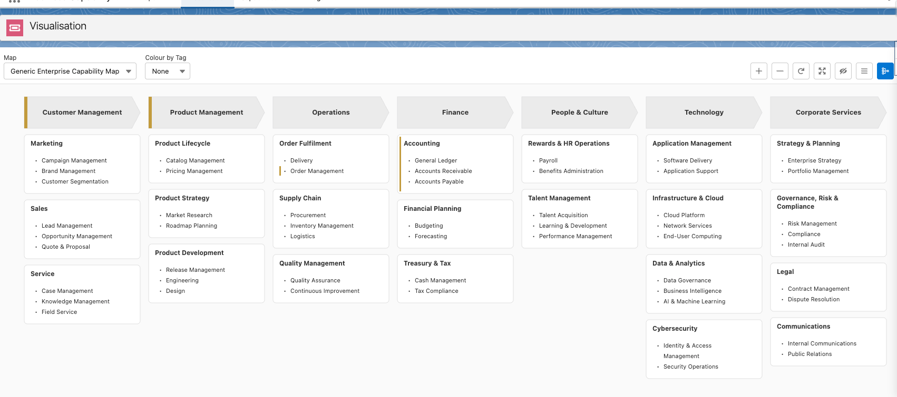

# bcm_CapabilityMap Visualisation — Component Design

## Part 1 — Product Overview (for stakeholders and new contributors)

### What the component does

`bcm_CapabilityMap` is the main visualisation surface of the Business Capability Map app. It renders an interactive SVG diagram of capabilities grouped by level and column, loaded from Salesforce records.

### Visual structure

```
┌─────────────────────────────────────────────────────────────────────────┐
│ TOOLBAR                                                                 │
│  [Map ▾]  [Colour by Tag ▾]    [+][-][↺][⤢][👁][≡][★]                 │
├─────────────────────────────────────────────────────────────────────────┤
│                                                                         │
│  ┌──────────────┐  ┌──────────────┐  ┌──────────────┐                  │
│  │   L1: Sales  │  │ L1: Finance  │  │    L1: HR    │   ← chevrons     │
│  └──────────────┘  └──────────────┘  └──────────────┘                  │
│  ┌────────────┐    ┌────────────┐    ┌────────────┐                    │
│  │ L2: Oppty  │    │ L2: Budget │    │ L2: Recruit│   ← boxes         │
│  │ • L3 item  │    │ • L3 item  │    │ • L3 item  │                    │
│  │ • L3 item  │    └────────────┘    └────────────┘                    │
│  └────────────┘                                                         │
│                                                                         │
│  ══════════════════════════════════════════  ← cross-cutting band       │
│  ══════════════════════════════════════════    (toggle-able)            │
│                                                                         │
└─────────────────────────────────────────────────────────────────────────┤
                                                       ┌───────────────┐  │
                                                       │ Detail Panel  │  │
                                                       │ (slide-out)   │  │
                                                       └───────────────┘  │
```

**Levels:**

- **L1** — rendered as right-pointing chevron polygons, one per column, pinned at the top
- **L2** — rendered as rounded rectangles stacked below their parent L1 chevron
- **L3** — rendered as bullet-point text lines inside their parent L2 box
- **Cross-cutting band** — full-width stacked chevrons below the main grid, toggled separately

Screenshot


### Toolbar controls

| Control                | Action                                                  |
| ---------------------- | ------------------------------------------------------- |
| Map combobox           | Loads capabilities for a different map; resets zoom/pan |
| Colour by Tag combobox | Highlights L2/L3 boxes with the tag's colour            |
| `+` / `-`              | Zoom in / out by 0.1                                    |
| `↺`                    | Reset zoom to 1.0, pan to origin                        |
| `⤢`                    | Fit entire diagram inside the visible container         |
| `👁` (eye)             | Toggle visibility of hidden capabilities (shown dashed) |
| `≡` (rows)             | Toggle cross-cutting band below the main grid           |
| `★` (strategy)         | Toggle strategy support stripe overlays                 |

### Node interaction model

**Click:**

- First click on a node → focuses it (focus ring appears)
- Second click on the same focused node → opens the detail panel
- If the detail panel is already open, clicking any node immediately opens that node's detail

**Detail panel:**

- Slides in from the right edge
- Shows breadcrumb, definition, strategy support, architectural nuance
- Users with `bcm_CanEdit` custom permission can edit fields inline

**Drag-drop (editors only):**

- Braille handle (`⠿`) appears on L1/L2 nodes and L3 bullet hit areas when `bcm_CanEdit` is true
- Drag L1 → reorders columns
- Drag L2 → reorders within a column, or moves to a different column (reparents)
- Drag L3 → reorders within an L2 box, or moves to a different L2 box (reparents)
- A drop indicator line shows the insertion point
- Ghost (semi-transparent outline) follows the cursor during drag
- Escape cancels the drag with no changes

**Keyboard:**

- Arrow keys pan the canvas when no node is focused
- When a node is focused, arrow keys move focus between nodes
- Escape exits focus mode and returns to pan mode

**Zoom/pan:**

- Mouse wheel zooms toward the cursor
- Click-drag on the canvas background pans
- Both X and Y pan are clamped to prevent the diagram from being dragged fully off-screen

---

## Part 2 — Technical Reference (for engineers)

### File inventory

| Path                                                                      | Purpose                                                            |
| ------------------------------------------------------------------------- | ------------------------------------------------------------------ |
| `force-app/.../lwc/bcm_CapabilityMap/bcm_CapabilityMap.js`                | All logic: data loading, layout calculation, event handling        |
| `force-app/.../lwc/bcm_CapabilityMap/bcm_CapabilityMap.html`              | SVG template, toolbar, detail panel host                           |
| `force-app/.../lwc/bcm_CapabilityMap/bcm_CapabilityMap.css`               | Canvas container, toolbar, panel clip styles                       |
| `force-app/.../lwc/bcm_CapabilityMap/__tests__/bcm_CapabilityMap.test.js` | Jest unit tests                                                    |
| `force-app/.../lwc/bcm_CapabilityDetail/`                                 | Slide-out detail panel child component                             |
| `force-app/.../lwc/bcm_VisualTokens/bcm_VisualTokens.js`                  | Centralised colour/style constants                                 |
| `force-app/.../classes/bcm_MapController.cls`                             | `getMaps()`                                                        |
| `force-app/.../classes/bcm_CapabilityController.cls`                      | `getCapabilities()`, `getCapabilityDetail()`, `updateCapability()` |
| `force-app/.../classes/bcm_TagController.cls`                             | `getTags()`                                                        |
| `force-app/.../classes/bcm_DragDropController.cls`                        | `reorderCapabilities()`, `reparentCapability()`                    |

### Data flow

```
Apex (wire)          JS state               SVG template
───────────          ────────               ────────────
getMaps()        →   mapOptions[]       →   Map combobox options
getTags()        →   tagOptions[]           Tag combobox options
                     _tagColourMap{}        (used by _getTagFill)

getCapabilities()→   _capabilities[]    →   _buildLayout()
                                        →   _layoutL1[]        →   <g transform={l1Transform}>
                                            _layoutL2[]        →   <g transform={viewportTransform}>
                                            _layoutBand[]      →   <g transform={bandTransform}>
                                            _layoutL3Map{}         (used by keyboard nav)
                                            _l3ByL2{}              (used by keyboard nav)
                                            _colMap{}              (used by keyboard nav)
                                            _l2ByCol{}             (used by keyboard nav)

getCapabilityDetail() → detailCapability → <c-bcm_-capability-detail>
```

`_buildLayout()` is the single function that transforms raw `_capabilities[]` into all layout arrays. It is called after every state change that affects visual output: map change, tag change, toggle changes, drag-drop, and detail save.

### Layout algorithm

#### Layout constants

| Constant            | Value                          | Controls                                                 |
| ------------------- | ------------------------------ | -------------------------------------------------------- |
| `COLUMN_WIDTH`      | 220px                          | Width of every column (chevron + all L2 boxes below it)  |
| `COLUMN_GAP`        | 16px                           | Horizontal gap between adjacent columns                  |
| `CHEVRON_HEIGHT`    | 60px                           | Height of the L1 row                                     |
| `CHEVRON_NOTCH`     | 16px                           | Depth of the right-pointing arrow tip on L1 chevrons     |
| `BOX_PADDING`       | 12px                           | Internal padding inside L2 boxes (all sides)             |
| `LINE_HEIGHT`       | 20px                           | Height reserved per L3 bullet line                       |
| `BOX_GAP`           | 12px                           | Vertical gap between consecutive L2 boxes in a column    |
| `DIAGRAM_PADDING`   | 24px                           | Outer margin around the entire diagram                   |
| `FONT_SIZE_L1`      | 13px                           | L1 chevron label font size                               |
| `FONT_SIZE_L2`      | 12px                           | L2 box header font size                                  |
| `FONT_SIZE_L3`      | 11px                           | L3 bullet font size                                      |
| `BULLET_INDENT`     | `FONT_SIZE_L3 × 0.6 × 2`       | Indent for the`• ` prefix (bullet + space, each ~0.6em)  |
| `ZOOM_MIN`          | 0.2                            | Minimum zoom level                                       |
| `ZOOM_MAX`          | 3.0                            | Maximum zoom level                                       |
| `ZOOM_STEP`         | 0.1                            | Increment per zoom toolbar button press or wheel tick    |
| `ZOOM_DEFAULT`      | 1.0                            | Zoom on fresh map load                                   |
| `PEEK_OFFSET`       | 60px                           | How far content may be panned past the clamp boundary    |
| `PAN_STEP`          | 50px                           | Pan distance per arrow key press (pan mode)              |
| `BAND_ROW_OVERLAP`  | 12px                           | Vertical overlap between stacked cross-cutting band rows |
| `BAND_NOTCH`        | 32px                           | Arrow notch depth for band chevrons (2×`CHEVRON_NOTCH`)  |
| `STRATEGY_STRIPE_W` | `BCM_STRATEGY_MARK.weight / 2` | Width of the strategy support left-edge stripe           |

#### `_buildLayout(capabilities)` — pseudocode

```
function _buildLayout(capabilities):
  if capabilities is empty → clear all layout state, return

  // 1. Build id→node map and wire parent-child relationships
  nodeMap = Map<Id, { ...cap, children: [] }>
  for each cap in capabilities:
    if cap has parent and parent is in nodeMap:
      nodeMap[parent].children.push(nodeMap[cap.Id])
    else if cap has no parent:
      roots.push(nodeMap[cap.Id])

  // 2. Sort every level by bcm_SortOrder__c
  sortByOrder(roots)
  for each node in nodeMap: sortByOrder(node.children)

  // 3. Partition roots into regular L1s and cross-cutting L1s
  ccRoots    = roots where bcm_IsCrossCutting__c == true
  regularRoots = roots where bcm_IsCrossCutting__c == false

  // 4. Hidden cascade (two passes)
  Pass 1: for each node → node._hidden = !!bcm_HideFromDiagram__c
  Pass 2: BFS from roots — if parent._hidden then child._hidden = true

  // 5. Layout L1 chevrons (regular roots only)
  visibleColIdx = 0
  for each l1 in regularRoots:
    if l1._hidden and showHidden is OFF → skip

    colX = DIAGRAM_PADDING + visibleColIdx × (COLUMN_WIDTH + COLUMN_GAP)
    x = colX, y = DIAGRAM_PADDING, w = COLUMN_WIDTH, h = CHEVRON_HEIGHT
    points = 5-point chevron polygon:
      (x, y), (x+w-NOTCH, y), (x+w, y+h/2), (x+w-NOTCH, y+h), (x, y+h)
    textLines = wrapText(l1.Name, w - BOX_PADDING×2, FONT_SIZE_L1, maxLines=3)
    strategyMark = if showStrategicSupport and l1 has strategy text:
      rect stripe on left straight edge of chevron

    append to _layoutL1
    colMap[visibleColIdx] = l1.Id
    l2ByCol[visibleColIdx] = []
    visibleColIdx++

    // 5a. Layout L2 boxes in this column
    boxY = DIAGRAM_PADDING + CHEVRON_HEIGHT + BOX_GAP
    for each l2 in l1.children:
      if l2._hidden and showHidden is OFF → skip

      tagFill = _getTagFill(l2.Id, l2.Tags__r)   // colour or fallback white

      l2Lines = wrapText(l2.Name, COLUMN_WIDTH - BOX_PADDING×2, FONT_SIZE_L2, maxLines=10)
      headerHeight = l2Lines.length × (FONT_SIZE_L2 + 4) + BOX_PADDING×2

      // 5b. Layout L3 bullets inside this L2
      bulletY = boxY + headerHeight
      bulletGroups = []
      for each l3 in l2.children:
        if l3._hidden and showHidden is OFF → skip
        lines = wrapText(l3.Name, availableWidth, FONT_SIZE_L3, maxLines=5)
        for each line: y = bulletY + lineIdx × LINE_HEIGHT
        bulletY += lines.length × LINE_HEIGHT
        append bulletGroup (focusRect, tagRect, strategyMark, lines, dragHandle hit area)

      boxHeight = headerHeight + (bulletY - (boxY + headerHeight)) + BOX_PADDING
      append to _layoutL2 with { x:colX, y:boxY, width:COLUMN_WIDTH, height:boxHeight, ... }
      boxY += boxHeight + BOX_GAP
      l2ByCol[visibleColIdx-1].push(l2.Id)

    tallestColumnHeight = max(tallestColumnHeight, sum of this column's heights)

  // 6. Build L3 lookup maps (used by keyboard navigation)
  _layoutL3Map = Map<l3Id, { anchorX, anchorY, parentL2Id, siblingIdx }>
  _l3ByL2     = Map<l2Id, [l3Id, ...]>

  // 7. Layout cross-cutting band (full-width stacked chevrons)
  if ccRoots is not empty:
    bandX = DIAGRAM_PADDING
    bandW = canvasWidth - DIAGRAM_PADDING×2
    bandTopY = DIAGRAM_PADDING + headerReserved + tallestColumnHeight + BOX_GAP
    for i from ccRoots.length-1 down to 0:   // reversed so index-0 is DOM-last (painted on top)
      y = bandTopY + i × (CHEVRON_HEIGHT - BAND_ROW_OVERLAP)
      fill = BCM_BAND_RAMP[i % rampLength]
      labelColor = light or dark depending on fill luminance (WCAG contrast check)
      append to _layoutBand
```

#### Canvas size

```
canvasWidth  = DIAGRAM_PADDING×2 + visibleColCount×COLUMN_WIDTH + (visibleColCount-1)×COLUMN_GAP
canvasHeight = DIAGRAM_PADDING×2 + CHEVRON_HEIGHT + BOX_GAP + tallestColumnHeight
             + (if showCrossCutting: bandRows×CHEVRON_HEIGHT - (bandRows-1)×BAND_ROW_OVERLAP + BOX_GAP)
```

#### Text wrapping (`wrapText`)

SVG has no native text wrapping. Character width is approximated as `fontSize × 0.6`. Words are greedily accumulated into lines; a new line starts when adding the next word would exceed `maxWidth`. Truncation stops at `maxLines` — any remaining words are silently dropped. L3 bullets use `maxLines=5`; L2 headers use `maxLines=10` (effectively uncapped for practical label lengths).

#### Tag fill (`_getTagFill`)

When a tag is selected: if the capability's `Tags__r` junction list contains a record pointing to the selected tag, return the tag's `bcm_Colour__c`. Otherwise return `BCM_TAG_FALLBACK` (white). If no tag is selected, always return `BCM_TAG_FALLBACK`. This runs at layout time — no re-fetch on tag change, only `_buildLayout()` is re-called.

#### Strategy marks

A coloured rect stripe rendered over the left edge of a node when `showStrategicSupport` is on and the node's `bcm_StrategySupport__c` rich-text field contains non-whitespace content (`isStrategic()` strips HTML tags before checking).

- L1: stripe along the left straight edge of the chevron polygon (derived from polygon points[0] and points[4])
- L2/L3: `STRATEGY_STRIPE_W`-wide rect inset from top-left of the box/bullet area

---

### SVG layer architecture

The SVG contains three independent `<g>` layers with different transforms:

```
<svg>
  <!-- Layer 1: L2 boxes + L3 bullets — full pan+zoom -->
  <g transform="translate(panX, panY) scale(zoom)">   ← viewportTransform
    for each node in _layoutL2 ...
  </g>

  <!-- Layer 2: L1 chevrons — horizontal pan only, no vertical pan, same zoom -->
  <g transform="translate(panX, 0) scale(zoom)">      ← l1Transform
    for each node in _layoutL1 ...
  </g>

  <!-- Layer 3: cross-cutting band — full pan+zoom (same as Layer 1) -->
  <g transform="translate(panX, panY) scale(zoom)">   ← bandTransform
    for each node in _layoutBand ...
  </g>

  <!-- Drop indicator and ghost — also in viewportTransform coords -->
  ...
</svg>
```

> **Why L1 uses a different transform:** L1 chevrons act as sticky column headers. When the user pans vertically to scroll through L2 boxes, the chevrons stay pinned at the top — only horizontal pan moves them. This is achieved by applying `panX` but not `panY` to the L1 layer. L1 is drawn after L2 in the DOM so it always paints on top regardless of vertical scroll position.

---

### Canvas panning

Pan state: `_panX`, `_panY` (numbers, default 0).

**Mouse drag on background:**

```
handleSvgMouseDown(evt):
  if evt target is a node → do not start pan (node click takes precedence)
  clear focusedNodeId, exit key-nav mode
  _isDragging = true
  _dragStartX = evt.clientX, _dragStartY = evt.clientY
  _panStartX = panX, _panStartY = panY

handleSvgMouseMove(evt):
  if not _isDragging → return
  panX = clampPanX(_panStartX + (evt.clientX - _dragStartX))
  panY = clampPanY(_panStartY + (evt.clientY - _dragStartY))

handleSvgMouseUp → _isDragging = false
```

**Pan clamping:**

- X: diagram may be panned `PEEK_OFFSET` past either horizontal edge
- Y: upper bound is 0 (content top never below viewport top); lower bound is `l2ClipY + PEEK_OFFSET - lowestL2Top × zoom` (keeps at least `PEEK_OFFSET` pixels of content visible above the clip line)

**Wheel zoom (zoom toward cursor):**

```
newPanX = mouseX - (mouseX - panX) × (newZoom / oldZoom)
newPanY = mouseY - (mouseY - panY) × (newZoom / oldZoom)
```

This preserves the diagram point under the cursor at the same screen position after the zoom change.

---

### Node drag-drop

This is a separate drag system from canvas panning. It is active only when the user mousedowns on a `⠿` drag handle element, not on the SVG background.

#### State during drag

```
isDragging          boolean  — true while a node drag is in flight
ghost               object   — { isL1/isL2/isL3, x, y, width, height, points, label, ... }
dropIndicator       object   — { x1, y1, x2, y2 } line to draw
_draggedNodeId      string   — Id of node being dragged
_draggedNodeLevel   number   — 1, 2, or 3
_ghostOffsetX/Y     number   — cursor offset from ghost origin at drag start
_dropTargetInfo     object   — { parentId, position, level } or null
_preDragSnapshot    array    — deep copy of _capabilities[] for rollback on error
isSavingDragDrop    boolean  — true while Apex call is in flight (disables Map combobox)
```

#### Drag lifecycle

```
handleHandleMouseDown(evt):
  convert client coords to viewport coords (_clientToViewport)
  build ghost shape from layout node (_buildGhostFromLayoutNode)
  snapshot _capabilities[] for rollback
  attach mousemove + mouseup + keydown listeners to window
  set isDragging = true

_handleDragMouseMove(evt):
  update ghost.x/y = viewportPoint - _ghostOffset
  _dropTargetInfo = _hitTest(viewportX, viewportY, level)
  dropIndicator = _buildDropIndicator(_dropTargetInfo)

_handleDragMouseUp():
  detach window listeners
  if no valid target → discard, cleanup, return
  compute newSiblings (ordered Id list) at drop position
  detect no-op (same parent, same order) → discard if true
  apply optimistic update to _capabilities[] (_applyOptimisticReorder)
  _buildLayout() immediately (instant UI feedback)
  isSavingDragDrop = true
  call Apex:
    sameParent → reorderCapabilities({ orderedIds: newSiblings })
    different parent → reparentCapability({ capabilityId, newParentId, newSiblingIds, oldSiblingIds })
  on success → refreshApex(_wiredCaps), isSavingDragDrop = false
  on error → restore _capabilities from _preDragSnapshot, _buildLayout(), show toast, isSavingDragDrop = false

_handleDragKeyDown(Escape):
  detach window listeners
  discard ghost, dropIndicator, isDragging = false
  (no rollback needed — _capabilities was not yet mutated)
```

#### Hit testing (`_hitTest`)

Converts viewport coordinates to a drop target:

- **L1:** Finds which gap between column centers the cursor is in; returns `{ parentId: null, position: i }` where `i` is the insertion index among root nodes.
- **L2:** Checks which column the cursor X falls in; walks L2 boxes in that column, comparing cursor Y to each box's vertical midpoint. Returns `{ parentId: l1.id, position: i }`.
- **L3:** First finds which L2 box contains the cursor; then compares cursor Y to each bullet group's first-line Y. Returns `{ parentId: l2.id, position: i }`.

#### Drop indicator

A single `<line>` rendered at the insertion position:

- L1: vertical line between columns at the target gap
- L2/L3: horizontal line above/below the target insertion slot

#### Optimistic level cascade

When a node is reparented, `_applyOptimisticReorder` recalculates `bcm_Level__c` for the moved node and all its descendants via BFS. This keeps the layout consistent before Apex confirms.

#### Coordinate system during drag

All ghost and drop indicator positions are in **viewport (diagram) coordinates**, not screen/client coordinates. `_clientToViewport` converts:

```
viewportX = (clientX - svgRect.left - panX) / zoom
viewportY = (clientY - svgRect.top  - panY) / zoom
```

The ghost is then placed using a `<g transform="translate(ghost.x, ghost.y)">` inside the viewportTransform `<g>` — so the same zoom+pan applies to the ghost as to the rest of the diagram.

> **Why viewport coords, not client coords:** If the ghost were positioned in client/screen space it would drift relative to the diagram when the user zooms mid-drag, and the drop indicator (computed in diagram space) would misalign with the ghost. Keeping both in the same coordinate space guarantees they stay in sync.

---

### Keyboard navigation

Two distinct modes with different arrow key behaviour:

```
                    ┌───────────────────────────┐
                    │         PAN MODE          │
                    │  (_keyNavMode = false)    │◄──────────────────┐
                    │  Arrows pan the canvas    │                   │
                    └─────────────┬─────────────┘                   │
                                  │                                  │
                    click any     │                           Escape key OR
                    node          │                           click on SVG background
                                  ▼                                  │
                    ┌───────────────────────────┐                   │
                    │       KEY-NAV MODE        │───────────────────┘
                    │  (_keyNavMode = true)     │
                    │  Arrows move focus        │
                    │  focusedNodeId ≠ null     │
                    └─────────────┬─────────────┘
                                  │
                    click already │
                    focused node  │
                    (2nd click)   │
                                  ▼
                    ┌───────────────────────────┐
                    │      PANEL OPEN           │
                    │  (detailCapability ≠ null)│
                    │  KEY-NAV MODE still on    │
                    │  Any node click → swap    │
                    │  panel to that node       │
                    └───────────────────────────┘
```

**Arrow key navigation rules (KEY-NAV MODE):**

| Focused level | ArrowUp                                      | ArrowDown                         | ArrowLeft                                                       | ArrowRight                               |
| ------------- | -------------------------------------------- | --------------------------------- | --------------------------------------------------------------- | ---------------------------------------- |
| L1            | —                                            | First L2 in same column           | First L2 in prev column (or L1 if empty)                        | First L2 in next column (or L1 if empty) |
| L2            | Previous L2 in column, or parent L1 if first | Next L2 in column (no-op if last) | L2 at same row index in prev column (or that col's L1 if empty) | L2 at same row index in next column      |
| L3            | Previous L3 sibling, or parent L2 if first   | Next L3 sibling (no-op if last)   | —                                                               | —                                        |

**Implementation note:** The root keydown handler (`_handleRootKeyDown`) is registered on both `this.template` and `window`. Native keyboard events are `composed: true` so they can hit both listeners. A per-event marker (`evt.__bcmHandled`) ensures the handler runs only once. The handler bails out early if the event originated inside an `<input>`, `<textarea>`, `<select>`, `lightning-combobox`, or `lightning-input` element — preventing arrow keys from conflicting with toolbar combobox navigation.

---

### Detail panel

`bcm_CapabilityDetail` is a child LWC embedded at the bottom of `bcm_CapabilityMap`'s template. It slides in from the right via `translateX` CSS transition (100% → 0).

The panel is hosted in a `div.bcm-panel-clip` wrapper that constrains `overflow: hidden` to just the panel's off-screen slide area, without clipping toolbar dropdowns or toast notifications.

#### Panel open / close flow

```
handleViewDetail(evt):
  reqId = ++_detailRequestSeq        // race guard (see below)
  detailIsLoading = true
  detailCapability = null
  detailBreadcrumb = _buildBreadcrumb(id)   // built from cached _capabilities[], instant
  call getCapabilityDetail({ capabilityId: id })
    on resolve: if reqId === _detailRequestSeq → detailCapability = rec
    on reject:  if reqId === _detailRequestSeq → detailErrorMessage = ...
    finally:    if reqId === _detailRequestSeq → detailIsLoading = false

handleDetailClose():
  ++_detailRequestSeq                // invalidates any in-flight Apex response
  detailCapability = null
  detailBreadcrumb = []
  detailIsLoading = false

handleDetailSaved(evt):
  call updateCapability(...)
    on resolve: optimistically update _capabilities[], _buildLayout(),
                refreshApex(_wiredCaps), re-fetch getCapabilityDetail to refresh panel
```

> **Why `_detailRequestSeq`:** `getCapabilityDetail` is an imperative Apex call. If the user clicks node A, then immediately clicks node B before A's response arrives, two responses are in flight. Without the sequence counter, A's response (arriving later due to latency) would overwrite B's data in the panel. The counter ensures only the response matching the most recent request is applied.

---

### Session storage restore

Three keys are persisted across page reloads:

| Key                                    | Value         | Restored in          |
| -------------------------------------- | ------------- | -------------------- |
| `bcm.visualisation.selectedMapId`      | Map record Id | `wiredMaps` callback |
| `bcm.visualisation.selectedTagId`      | Tag record Id | `wiredTags` callback |
| `bcm.visualisation.strategicSupportOn` | `'true'`      | `connectedCallback`  |

> **Why strategic toggle restores in `connectedCallback`:** The strategic support toggle only affects layout rendering, not data loading. It does not need to wait for wire data before applying. Restoring it immediately in `connectedCallback` means the first `_buildLayout()` call (triggered by `wiredCapabilities`) already has the correct `showStrategicSupport` value and renders correctly without a flicker.

> **Why map restores before tag:** The tag restore (`_maybeRestoreSelectedTag`) validates the persisted tag Id against the `_tagColourMap` that is built from wire data. Map restore validates against `mapOptions`. The two are independent — but if the tag Id is no longer valid (tag deleted), it is silently cleared. If the map Id is no longer valid, it is also silently cleared. Neither restore triggers a second attempt.

> **`safeSessionGet/Set/Remove`:** All sessionStorage access is wrapped in try/catch. Safari in private browsing and some SF sandboxes block sessionStorage, throwing `SecurityError`. The safe wrappers return `null` on failure, causing restore to silently no-op.

---

### Visual tokens

All colours and style values are imported from `c/bcm_VisualTokens`. No colour literals appear in `bcm_CapabilityMap`. Relevant tokens:

| Token                      | Used for                                          |
| -------------------------- | ------------------------------------------------- |
| `BCM_L1_FILL`              | L1 chevron fill (default)                         |
| `BCM_L1_FILL_FOCUSED`      | L1 chevron fill when focused                      |
| `BCM_L1_STROKE`            | L1 chevron border                                 |
| `BCM_L1_LABEL`             | L1 text colour                                    |
| `BCM_L2_STROKE`            | L2 box border                                     |
| `BCM_L2_LABEL`             | L2 header text colour                             |
| `BCM_L2_GHOST_FILL`        | L2 ghost rect fill during drag                    |
| `BCM_L3_LABEL`             | L3 bullet text colour                             |
| `BCM_L3_LABEL_DIMMED`      | L3 text colour when node is hidden (shown dashed) |
| `BCM_TAG_FALLBACK`         | Default fill when no tag match (white)            |
| `BCM_FOCUS_RING`           | Focus ring stroke colour                          |
| `BCM_BAND_RAMP`            | Array of fills for cross-cutting band rows        |
| `BCM_BAND_LABEL_LIGHT`     | Band label colour on dark fills                   |
| `BCM_BAND_LABEL_DARK`      | Band label colour on light fills                  |
| `BCM_BAND_STROKE`          | Band chevron border                               |
| `BCM_STRATEGY_MARK`        | `{ weight, colour }` for strategy stripes         |
| `BCM_PANEL_SECONDARY_TEXT` | Drag handle glyph colour                          |

Band label colour is chosen at layout time using `hexLuminance()` — a WCAG relative luminance formula — against a threshold of 0.179, ensuring readable contrast regardless of which ramp colour is used.

---

### Apex controllers and SOQL

All controllers are `with sharing`.

**`bcm_MapController.getMaps()`** — returns all `bcm_Map__c` records ordered by Name. Called via `@wire`, fires once on component load.

**`bcm_CapabilityController.getCapabilities(mapId)`** — returns all capabilities for the selected map including a `Tags__r` subquery. Called via `@wire` with `$selectedMapId` as reactive property; re-fires automatically when map changes.

```soql
SELECT Id, Name, bcm_Parent__c, bcm_Level__c, bcm_SortOrder__c,
       bcm_HideFromDiagram__c, bcm_IsCrossCutting__c,
       bcm_Definition__c, bcm_StrategySupport__c, bcm_ArchitecturalNuance__c,
       (SELECT bcm_Tag__c FROM Tags__r)
FROM bcm_Capability__c
WHERE bcm_Map__c = :mapId
ORDER BY bcm_Level__c ASC, bcm_SortOrder__c ASC
```

**`bcm_CapabilityController.getCapabilityDetail(capabilityId)`** — imperative call, fetches full record fields for the detail panel. Called on every panel open.

**`bcm_TagController.getTags()`** — called via `@wire`, fires once. Also refreshed via `refreshApex` when the tag combobox receives focus (to pick up any new tags created since page load).

**`bcm_DragDropController.reorderCapabilities(orderedIds)`** — writes sequential `bcm_SortOrder__c` values (1-based) to a list of sibling Ids. Used for same-parent reorder.

**`bcm_DragDropController.reparentCapability(capabilityId, newParentId, newSiblingIds, oldSiblingIds)`** — updates the moved node's `bcm_Parent__c`, cascades `bcm_Level__c` to all descendants, and writes sort orders for both old and new sibling lists.

---

### ResizeObserver

`renderedCallback` wires a `ResizeObserver` to `.bcm-canvas-container` to track `_containerWidth`. This is used by `_clampPanX` (to compute how far the diagram can be panned given the current container width and zoom) and by `handleFitToWindow` (to compute the zoom level that fits the diagram). The observer is disconnected in `disconnectedCallback`.

---

## Non-obvious decisions summary

| Decision                           | Why                                                                                                                                                                                                                                                                          |
| ---------------------------------- | ---------------------------------------------------------------------------------------------------------------------------------------------------------------------------------------------------------------------------------------------------------------------------- |
| L1 uses`l1Transform` (no panY)     | L1 chevrons act as sticky column headers — they pin at the top while L2 content scrolls under them                                                                                                                                                                           |
| `_detailRequestSeq` counter        | Prevents a slow`getCapabilityDetail` response from overwriting a newer panel open when the user clicks quickly between nodes                                                                                                                                                 |
| Session storage restore order      | Strategic toggle restores in`connectedCallback` (before any wire data) so the first layout render is already correct; map and tag restore in their respective wire callbacks where the options lists are available for validation                                            |
| Two click-paths for panel open     | When panel is closed: first click focuses, second opens (avoids accidental opens on mis-clicks). When panel is open: any click immediately switches to that node (panel is already committed to being open)                                                                  |
| Ghost in viewport coords           | Ghost and drop indicator are both computed in diagram space, ensuring they stay aligned when the user is zoomed in.`_clientToViewport` converts before any ghost positioning                                                                                                 |
| Band rendered in reverse DOM order | `ccRoots[last]` is appended to `bandNodes` first, so `bandNodes[0]` is the bottom-most row. It is painted first → behind. `bandNodes[last]` (sortOrder 1) is painted last → on top. This matches the visual stacking expectation without CSS z-index manipulation inside SVG |
